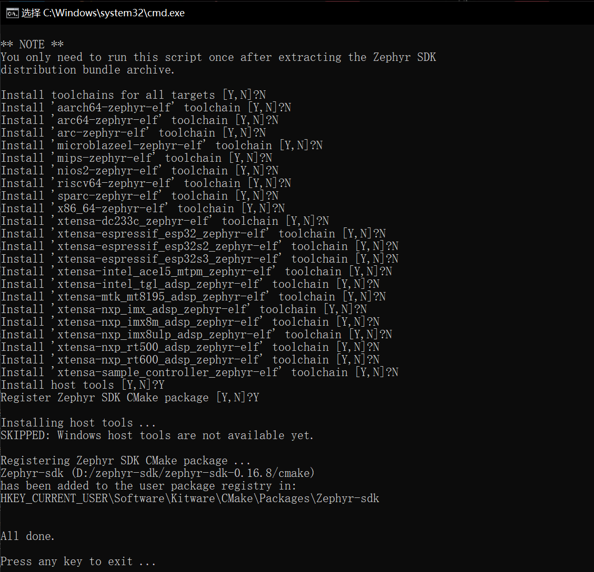
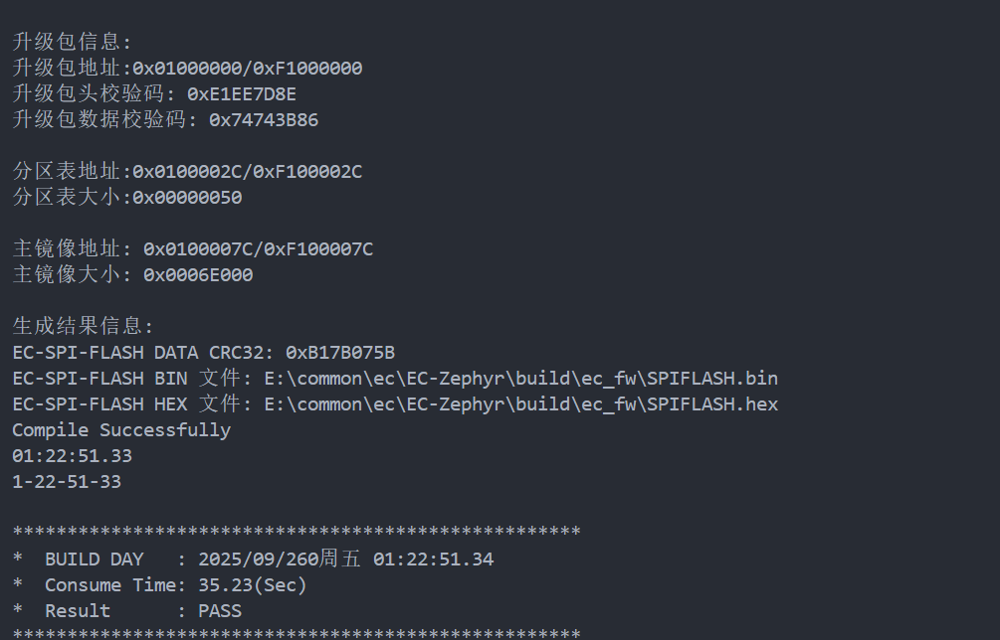

# 开发环境准备


本章节将指导用户如何搭建 CSCE250X 芯片基于 Zephyr 3.7.0
的固件开发环境。在开始固件开发前，客户需要完成以下准备工作：

- 安装必要的软件工具链（Zephyr SDK、Python、Git 等）；

- 获取工程源码（两种方式：使用官方 GitHub 仓库，或直接使用 Chipsea
  提供的打包工程）；

- 验证开发环境（确保能够编译和运行示例代码）。

## 软件工具链安装（Linux/Windows）

### Windows平台环境搭建

#### 安装chocolatey

Chocolatey 是 Windows 系统上的软件包管理器，它让你能像在 Linux 中使用
apt-get 或 yum
一样，通过命令行快速安装、更新和管理各种软件。请先确认您已经打开了Powershell并使用了管理员模式。使用
PowerShell 时，必须确保 Get-ExecutionPolicy 不是
Restricted。我们建议使用 Bypass 绕过策略以完成安装，或使用 AllSigned
获得更高的安全性。打开powershell，运行如下命令：

```
  Get-ExecutionPolicy

```

若返回Restricted则请执行如下：

```
  ExecutionPolicy AllSigned

```

或者

```
  Set-ExecutionPolicy Bypass -Scope Process

```

然后运行下列命令安装chocolatey

```
  Set-ExecutionPolicy Bypass -Scope Process -Force;
  \[System.Net.ServicePointManager\]::SecurityProtocol =
  \[System.Net.ServicePointManager\]::SecurityProtocol -bor 3072; iex ((New-Object
  System.Net.WebClient).DownloadString('https://community.chocolatey.org/install.ps1'))

```

若未出现任何错误，则chocolatey已经安装完毕，终端输入choco或choco
-?查阅使用说明。

#### 安装其他软件

安装好chocolatey后，就可以使用chocolatey来安装其他软件了。以管理员身份打开
cmd.exe 终端窗口。具体操作步骤如下：按下 Windows 键，输入
cmd.exe，右键点击命令提示符搜索结果，然后选择"以管理员身份运行"。

禁用全局确认以避免需要确认每个程序的安装：执行以下指令：

```powershell
  choco feature enable -n allowGlobalConfirmation

```

使用 choco 安装所需依赖项：

```powershell
choco install cmake --installargs 'ADD_CMAKE_TO_PATH=System'

choco install ninja gperf python311 git dtc-msys2 wget 7zip
```

等待执行完毕，就安装好了我们需要的软件。

#### 配置编译环境

打开一个命令行，安装zephyr的官方工具，这依赖于您先前通过choco安装好的python环境：

```bash
  pip install west

```

然后获取zephyr的官方code，这一步并不需要和官网一样，去github去下载源码，因为有两点原因：一个是github网站不好连接，不一定能clone下来源码，第二个是clone下来的源码与我们实际的整个工程目录其实是不一致的，所以这一块直接用我们提供的Chipsea
Zephyr SDK。其目录如下：

```bash
EC-ZEPHYR

┣ .vscode

┗ .west

┗ ecfw-zephyr

┗ ecfwwork

┃ ┣ modules

┃ ┗ zephyr_fork

┃ ┗ zephyr_modules_csce250x
```

导出 Zephyr CMake 包。这使 CMake 能自动加载构建 Zephyr
应用程序所需的模板代码。

```bash
  west zephyr-export

```

执行后会有如下日志：

```bash
PS E:\common\ec\EC-Zephyr> west zephyr-export

Zephyr (E:/common/ec/EC-Zephyr/ecfwwork/zephyr_fork/share/zephyr-package/cmake)

has been added to the user package registry in:

HKEY_CURRENT_USER\Software\Kitware\CMake\Packages\Zephyr

ZephyrUnittest
(E:/common/ec/EC-Zephyr/ecfwwork/zephyr_fork/share/zephyrunittest-package/cmake)

has been added to the user package registry in:

HKEY_CURRENT_USER\Software\Kitware\CMake\Packages\ZephyrUnittest
```

则说明导出CMake包成功。

#### 安装Python依赖

最后安装Python依赖，zephyr项目的编译，离不开python脚本，在项目包根目录下执行以下指令：

```bash
  pip install -r ecfwwork\zephyr_fork\scripts\requirements.txt

```

等待通过pip安装完毕即可。

#### 配置交叉编译链

Zephyr提供了多种方式来配置交叉编译链，当前我们只建议使用Zephyr
SDK来配置。

Zephyr软件开发工具包（SDK）包含针对Zephyr支持的每种架构的工具链，其中包含编译器、汇编器、链接器以及构建Zephyr应用程序所需的其他程序。

该工具包还包含额外的宿主工具，例如用于模拟、刷写和调试Zephyr应用程序的定制版QEMU和OpenOCD构建版本。

我们已经打包好该工具，在我们提供的资料中，zephyr-sdk-0.16.8即为交叉编译链。

1.  将其解压到C盘（或其他盘）

2.  进入\\zephyr-sdk-0.16.8目录，双击执行setup.cmd，每个选项如下所示，即只需要安装host
    tools以及注册Zephyr SDK CMake包，其余均选N。显示All
    done后则说明环境配置成功。

    {width="6.524305555555555in"
    height="6.29375in"}

    图 2-1

有一点需要注意的是，如果您之前已经使用过zephyr来开发的话，那么可能在系统环境变量中可能有
ZEPHYR_TOOLCHAIN_VARIANT，Zephyr项目会先寻找该环境变量是否设置，若没有才会去加载本地的zephyr
sdk，所以请必须要确认ZEPHYR_TOOLCHAIN_VARIANT是否已设置，如果设置了的话，zephyr项目会默认使用该编译链而不加载zephyr
sdk，那就可能会出现编译链版本问题导致编译失败。

当前默认规定Chipsea EC Zephyr项目使用zephyr
sdk编译！在编译脚本中已经忽略了ZEPHYR_TOOLCHAIN_VARIANT环境变量。

#### 首次编译

代码已经是一个标准的项目了，而且已经设置好了如何编译，打开
\\ecfw-zephyr路径，执行

```batch
  build.bat

```

即可编译完整项目。编译成功后会有如下日志：

{width="5.295138888888889in"
height="3.3930555555555557in"}

#### 烧录测试

安装Jlink开发包，导入Chipsea芯片开发包，打开JFlash，选择CSCE250X设备，然后导入要烧录的固件，生成的固件在\\build\\ec_fw目录下，选择
APROM.hex即可。烧录成功后打开Jlink RTT
View工具即可看到Zephyr的运行日志！则表示整个环境正常！

### Linux平台环境搭建

本节基于 Zephyr 3.7.0 LTS 官方文档，介绍在 Linux 系统上搭建 CSCE250X EC 固件开发环境的完整流程。支持 Ubuntu（20.04 及以上）、Fedora、Clear Linux 及 Arch Linux 等主流发行版。

#### 系统更新与基础依赖安装

首先确保系统软件包为最新。

Ubuntu / Debian：

```bash
  sudo apt update
  sudo apt upgrade

```

Fedora：

```bash
  sudo dnf upgrade

```

Arch Linux：

```bash
  sudo pacman -Syu

```

接下来安装编译所需的基础依赖项：

Ubuntu 22.04 及以上：

```bash
  sudo apt install --no-install-recommends git cmake ninja-build gperf \
    ccache dfu-util device-tree-compiler wget \
    python3-dev python3-pip python3-setuptools python3-tk python3-wheel xz-utils file \
    make gcc gcc-multilib g++-multilib libsdl2-dev libmagic1

```

若 Ubuntu 版本低于 22.04，需先添加 Kitware APT 仓库以满足 CMake 最低版本要求（≥3.20.5）：

```bash
  wget https://apt.kitware.com/kitware-archive.sh
  sudo bash kitware-archive.sh

```

然后再执行上述 `apt install` 命令。

Fedora：

```bash
  sudo dnf group install "Development Tools" "C Development Tools and Libraries"
  sudo dnf install cmake ninja-build gperf dfu-util dtc wget which \
    python3-pip python3-tkinter xz file python3-devel SDL2-devel

```

Arch Linux：

```bash
  sudo pacman -S git cmake ninja gperf ccache dfu-util dtc wget \
    python-pip python-setuptools python-wheel tk xz file make

```

Clear Linux：

```bash
  sudo swupd bundle-add c-basic dev-utils dfu-util dtc \
    os-core-dev python-basic python3-basic python3-tcl

```

安装完成后，验证关键工具的版本是否满足要求：

```bash
  cmake --version
  python3 --version
  dtc --version

```

Zephyr 3.7.0 要求的最低版本为：CMake 3.20.5、Python 3.10、DTC 1.4.6。

#### Python 虚拟环境（推荐）

为避免 Python 包版本冲突，强烈建议在 Python 虚拟环境中工作。所有后续操作应在虚拟环境中执行。

```bash
  sudo apt install python3-venv

```

在工作目录下创建并激活虚拟环境（示例中使用 `~/ec-zephyr-env`）：

```bash
  python3 -m venv ~/ec-zephyr-env
  source ~/ec-zephyr-env/bin/activate

```

命令执行后终端提示符前会出现 `(ec-zephyr-env)` 前缀，表示已进入虚拟环境。退出使用 `deactivate`。

> 注意： 每次新开终端时都需重新激活虚拟环境：`source ~/ec-zephyr-env/bin/activate`。

#### 获取 Chipsea Zephyr 工程包

与 Windows 平台一致，Linux 平台也直接使用 Chipsea 提供的打包工程，无需从 GitHub 克隆官方上游仓库。将 Chipsea Zephyr SDK 解压到工作目录（如 `~/EC-Zephyr`），其目录结构与 Windows 端完全相同：

```bash
EC-ZEPHYR

┣ .vscode

┗ .west

┗ ecfw-zephyr

┗ ecfwwork

┃ ┣ modules

┃ ┗ zephyr_fork

┃ ┗ zephyr_modules_csce250x
```

#### 安装 West 工具

`west` 是 Zephyr 的元工具，负责源码管理、构建、烧录等操作。

```bash
  pip install west

```

#### 导出 Zephyr CMake 包

在工程根目录执行 `west zephyr-export`，使 CMake 能自动加载构建 Zephyr 应用所需的模板代码：

```bash
  cd ~/EC-Zephyr
  west zephyr-export

```

执行成功后终端会显示类似如下日志：

```
  Zephyr (/path/to/EC-Zephyr/ecfwwork/zephyr_fork/share/zephyr-package/cmake)
  has been added to the user package registry in:
  ~/.cmake/packages/Zephyr

  ZephyrUnittest
  (/path/to/EC-Zephyr/ecfwwork/zephyr_fork/share/zephyrunittest-package/cmake)
  has been added to the user package registry in:
  ~/.cmake/packages/ZephyrUnittest

```

#### 安装 Python 依赖

Zephyr 构建过程依赖大量 Python 脚本。在项目包根目录下执行：

```bash
  pip install -r ecfwwork/zephyr_fork/scripts/requirements.txt

```

等待 pip 安装全部依赖完毕即可。

#### 配置交叉编译链（Zephyr SDK）

Zephyr SDK（v0.16.8）是 Zephyr 3.7.0 官方推荐的交叉编译工具链，包含 ARM Cortex-M 等架构的编译器、汇编器、链接器，以及 QEMU 和 OpenOCD 等调试工具。

1.  下载 Zephyr SDK（根据主机架构选择 x86_64 或 aarch64）：

```bash
    | cd ~
    |
    | \# x86_64 主机
    |
    | wget https://github.com/zephyrproject-rtos/sdk-ng/releases/download/
    | v0.16.8/zephyr-sdk-0.16.8_linux-x86_64.tar.xz
    |
    | \# aarch64 主机（如树莓派）
    |
    | wget https://github.com/zephyrproject-rtos/sdk-ng/releases/download/
    | v0.16.8/zephyr-sdk-0.16.8_linux-aarch64.tar.xz
```

2.  验证下载完整性：

```bash
    | wget -O - https://github.com/zephyrproject-rtos/sdk-ng/releases/
    | download/v0.16.8/sha256.sum | shasum --check --ignore-missing
```

3.  解压 SDK（建议解压到 `$HOME`、`$HOME/.local` 或 `/opt` 目录）：

```bash
    | tar xvf zephyr-sdk-0.16.8_linux-x86_64.tar.xz
```

4.  运行 SDK 安装脚本：

```bash
    | cd zephyr-sdk-0.16.8
    |
    | ./setup.sh
```

    脚本会注册 Zephyr SDK CMake 包，后续构建时 CMake 可自动发现工具链。

    > 注意： 如果移动了 SDK 目录，必须重新运行 `./setup.sh`。

5.  安装 udev 规则（允许普通用户烧录大多数 Zephyr 开发板）：

```bash
    | sudo cp ~/zephyr-sdk-0.16.8/sysroots/x86_64-pokysdk-linux/usr/
    | share/openocd/contrib/60-openocd.rules /etc/udev/rules.d
    |
    | sudo udevadm control --reload
```

#### 环境变量说明

与 Windows 同理，Linux 环境下也需确认未设置 `ZEPHYR_TOOLCHAIN_VARIANT` 环境变量（该变量会覆盖 Zephyr SDK 自动检测）。如果不确定，可执行以下命令清除：

```
  unset ZEPHYR_TOOLCHAIN_VARIANT

```

如果 Zephyr SDK 安装在非默认路径，可通过 `ZEPHYR_SDK_INSTALL_DIR` 环境变量指定：

```bash
  export ZEPHYR_SDK_INSTALL_DIR=/path/to/zephyr-sdk-0.16.8

```

可将该行追加到 `~/.bashrc` 或 `~/.zshrc` 中以持久化。

Chipsea EC Zephyr 项目默认规定使用 Zephyr SDK 编译，编译脚本已自动处理工具链选择。

#### 首次编译

在 `ecfw-zephyr` 路径下，执行构建脚本：

```batch
  cd ~/EC-Zephyr/ecfw-zephyr
  bash build.bat

```

> 注意： 项目提供的 `build.bat` 为 Windows 批处理脚本。Linux 下需查看该脚本的具体构建命令，通常等价于：
>
>   -----------------------------------------------------------------------
>   west build -b <board_name> . --build-dir build/ec_fw
>
>   -----------------------------------------------------------------------
>
> 具体命令请参考 `build.bat` 或 `configure-build.bat` 中的构建参数。

编译成功后，终端会输出固件生成路径 `build/ec_fw/APROM.hex` 等信息，表示编译环境搭建成功。

#### 烧录测试

1.  安装 J-Link 软件包（Linux 版本可从 [SEGGER 官网](https://www.segger.com/downloads/jlink/) 下载）。
2.  安装 Chipsea 芯片开发包（J-Link 设备支持包）。
3.  启动 JFlashLite（或命令行 JLinkExe），选择 CSCE250X 设备。
4.  加载编译生成的固件 `build/ec_fw/APROM.hex`。
5.  烧录完成后，通过 J-Link RTT Viewer 可查看 Zephyr 运行日志。

日志正常输出即表示整个 Linux 开发环境搭建完毕。

#### 常见问题排查

| 问题 | 可能原因 | 解决方案 |
|------|---------|---------|
| `cmake --version` 版本过低 | 系统默认 CMake 版本 < 3.20.5 | 参考上文添加 Kitware APT 仓库，或从 CMake 官网下载安装新版本 |
| `west: command not found` | pip 安装路径不在 `$PATH` 中 | 添加 `export PATH=$HOME/.local/bin:$PATH` 到 `~/.bashrc` |
| Zephyr SDK `./setup.sh` 失败 | 缺少 32 位库支持 | 安装 `gcc-multilib` 和 `g++-multilib` |
| 烧录时提示权限不足 | 未安装 udev 规则 | 参考 SDK 安装第 5 步，安装 `60-openocd.rules` |
| 编译报错 `python3 not found` | 系统 Python 版本或路径问题 | 使用 `python3 --version` 确认，确保版本 ≥ 3.10 |
| 虚拟环境未激活 | 新终端未 source activate | 每次新终端先执行 `source ~/ec-zephyr-env/bin/activate` |
