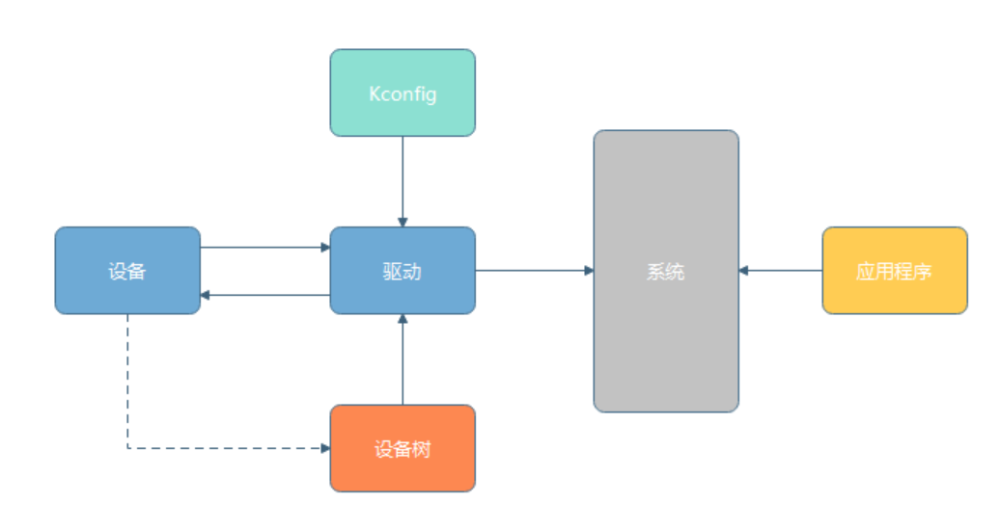
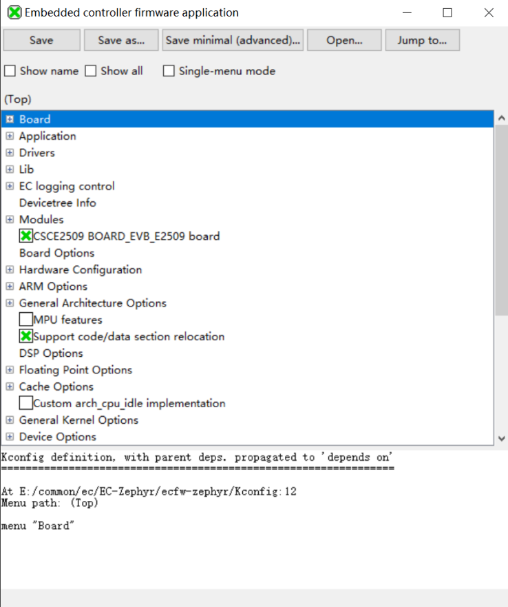
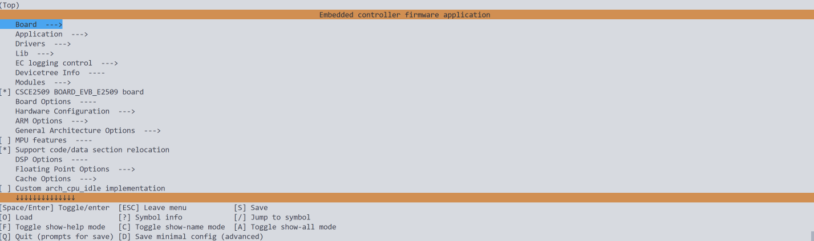

<div class="chapter-header"><span class="chapter-num">05</span><span class="separator">/</span><a href="../index.md">首页</a><span class="separator">›</span><a href="index.md">应用开发指南</a><span class="separator">›</span><span>Kconfig 配置系统</span></div>

### Kconfig 配置系统

Kconfig 是控制功能启用、驱动选择、编译参数的核心机制。配合 `prj.conf` 等配置文件，可以灵活裁剪系统。日常开发中，`prj.conf` 是最常修改的文件。

#### 基础概念

Kconfig 通过定义配置项为系统组件提供编译开关：

```kconfig
config UART_CONSOLE
    bool "Enable UART console"
    default y
    help
      Enable UART device as the system console.
```

| 关键字 | 含义 |
|--------|------|
| `config` | 配置项名称（如 `UART_CONSOLE`） |
| `bool` / `int` / `string` / `hex` | 配置类型 |
| `"Enable UART console"` | 菜单中显示的说明文字 |
| `default y` | 默认值 |
| `help` | 详细描述 |

#### 驱动、设备树与 Kconfig 的关系

{width="5.0569444444444445in" height="2.6847222222222222in"}

- Kconfig：决定驱动是否被编译进系统（软件层面开关）；
- 设备树（DTS）：决定驱动初始化时的硬件参数（地址、引脚、速率等）；
- 驱动：编译进内核后在系统中注册设备实例，供应用层调用；
- 应用程序：通过设备名称查找设备实例，调用 API 操作硬件。

#### 配置文件的组织

Kconfig 文件分多个层级：根目录 `Kconfig` 作为入口，子系统（`drivers/*/Kconfig`）、板级（`boards/`）、应用级（`app/Kconfig`）各自定义。模块间通过 `source` 语句串联。

常用配置文件：

| 文件 | 作用 |
|------|------|
| `prj.conf` | 应用层主配置，控制工程功能启用（最常用） |
| `boards/<board>_defconfig` | 板级默认配置 |
| `overlay.conf` | 特殊场景的功能叠加 |
| `debug.conf` / `release.conf` | 调试/发布差异化配置 |

示例 `prj.conf`：

```
## 启用日志与控制台
CONFIG_LOG=y
CONFIG_CONSOLE=y
CONFIG_UART_CONSOLE=y

## 启用 shell
CONFIG_SHELL=y
CONFIG_SHELL_BACKEND_SERIAL=y

## 启用 OTA
CONFIG_OTA_UPDATE=y
CONFIG_OTA_BUFFER_SIZE=1024
```

#### 配置生效流程

执行 `west build` 时，构建系统依次：
1. 解析所有 Kconfig 文件；
2. 读取应用配置（`prj.conf`）；
3. 根据依赖与默认值生成 `build/zephyr/.config`（最终配置）；
4. 转换为 `autoconf.h` 中的 C 宏，如 `#define CONFIG_LOG 1`。

C 代码中可直接使用：

```c
#if defined(CONFIG_OTA_UPDATE)
    ota_start_service(CONFIG_OTA_BUFFER_SIZE);
#endif
```

#### 配置文件优先级

多个配置来源同时存在时，高优先级覆盖低优先级（从低到高）：

1. 模块默认配置 — Kconfig 中的 `default` 值
2. Board 默认配置 — `boards/<board>_defconfig`
3. `prj.conf` — 应用层主配置，最常用的修改方式
4. 额外覆盖配置 — 通过 `-DOVERLAY_CONFIG=release.conf` 指定
5. 命令行配置 — `west build -DCONFIG_LOG=y`，最高优先级

#### 可视化配置

Zephyr 支持 menuconfig / guiconfig 交互式界面：

```bash
west build -t menuconfig
## 或
west build -t guiconfig
```

这会启动类似 Linux 内核的菜单界面，可手动启用或关闭配置项，退出时修改写回 `.config`。

{width="3.3541666666666665in" height="4.004166666666666in"}

{width="6.486111111111111in" height="1.9319444444444445in"}

#### 自定义 Kconfig

模块可以定义自己的配置项。例如为 OTA 模块添加 `Kconfig`：

```kconfig
menu "OTA Configuration"

config OTA_UPDATE
    bool "Enable OTA update feature"
    default n
    help
      Enable the OTA update functionality.

config OTA_BUFFER_SIZE
    int "OTA buffer size"
    default 512
    range 256 4096
    depends on OTA_UPDATE

endmenu
```

并在 `CMakeLists.txt` 中按条件编译：

```cmake
zephyr_library_sources_ifdef(CONFIG_OTA_UPDATE ota_update.c)
```

在 `prj.conf` 中启用即可：

```
CONFIG_OTA_UPDATE=y
CONFIG_OTA_BUFFER_SIZE=1024
```

